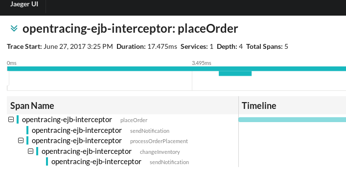

# OpenTracing EJB - Example

## The example

This example is a simple JAX-RS application that is annotated with `@Stateless`,
causing the endpoint to have the EJB capabilities. With that, we can specify the 
EJB OpenTracing interceptor to it, which will then wrap each invocation into a span.

Child invocations are added to the trace by using the regular `ActiveSpan` procedures,
which usually mean storing the `active` span into a Thread Local. So, if you go into 
async mode, you'll need to pass the span context explicitly.

The example has the following call tree:



Both async calls receive the `SpanContext`, and the last async method has no interceptor,
demonstrating how components can join an existing trace without using the interceptor.

Refer to each individual example for more information on how it works.

## Automatic tracing of all EJB methods

You might notice that we preferred to explicitly annotate the classes that we want intercepted.
All regular EJB rules apply here. For instance, if you want to intercept every method of every 
EJB, add an `ejb-jar.xml` to your deployment, like this:

```
<assembly-descriptor>
  <interceptor-binding>
     <ejb-name>*</ejb-name>
     <interceptor-class>io.opentracing.contrib.ejb.OpenTracingInterceptor</interceptor-class>
  </interceptor-binding>
</assembly-descriptor>
```


## Running

In order to visualize the spans, you'll need an instance of Jaeger running locally.
Any other OpenTracing tracer is supported: all it requires is to change the `pom.xml` 
to remove Jaeger's dependencies and add your `TracerResolver` compatible Tracer.

Jaeger can be run via Docker as follows:
```
docker run \
    --rm \
    -p5775:5775/udp \
    -p6831:6831/udp \
    -p6832:6832/udp \
    -p5778:5778 \
    -p16686:16686 \
    -p14268:14268 \
    --name=jaeger \
    jaegertracing/all-in-one:latest
```

Make sure to at least export the environment variable `JAEGER_SERVICE_NAME`, 
otherwise Jaeger will complain. A good set for development and testing purposes
is the following:

```
export JAEGER_SERVICE_NAME=swarm-opentracing-servlet-example
export JAEGER_REPORTER_LOG_SPANS=true 
export JAEGER_SAMPLER_TYPE=const
export JAEGER_SAMPLER_PARAM=1 
```

Once that is done, the example can be run as:
```
mvn wildfly:run
```

After Wildfly starts, traces can be created by making calls like this:
```
curl -v -X POST localhost:8080/opentracing-ejb-example/v1/order
```

If everything works as expected, the following can be seen on the logs:
```
15:23:41,115 INFO  [io.opentracing.contrib.ejb.example.Endpoint] (default task-3) Request received to place an order
15:23:41,117 INFO  [io.opentracing.contrib.ejb.example.AccountService] (default task-3) Notifying the account owner about a new order
15:23:41,118 INFO  [com.uber.jaeger.reporters.LoggingReporter] (default task-3) Span reported: 267358941d480ea6:e6887897ff751d87:267358941d480ea6:1 - sendNotification
15:23:41,121 INFO  [io.opentracing.contrib.ejb.example.OrderService] (default task-3) Placing order
15:23:41,124 INFO  [com.uber.jaeger.reporters.LoggingReporter] (default task-3) Span reported: 267358941d480ea6:5243b92429096623:267358941d480ea6:1 - placeOrder
15:23:41,125 INFO  [com.uber.jaeger.reporters.LoggingReporter] (default task-3) Span reported: 267358941d480ea6:267358941d480ea6:0:1 - placeOrder
15:23:41,126 INFO  [io.opentracing.contrib.ejb.example.InventoryService] (EJB default - 1) Changing the inventory
15:23:41,129 INFO  [com.uber.jaeger.reporters.LoggingReporter] (EJB default - 1) Span reported: 267358941d480ea6:3f6568012f9fceae:5243b92429096623:1 - changeInventory
15:23:41,131 INFO  [io.opentracing.contrib.ejb.example.InventoryNotificationService] (EJB default - 2) Sending an inventory change notification
15:23:41,134 INFO  [com.uber.jaeger.reporters.LoggingReporter] (EJB default - 2) Span reported: 267358941d480ea6:9a4a5391723d4099:3f6568012f9fceae:1 - sendNotification
```
